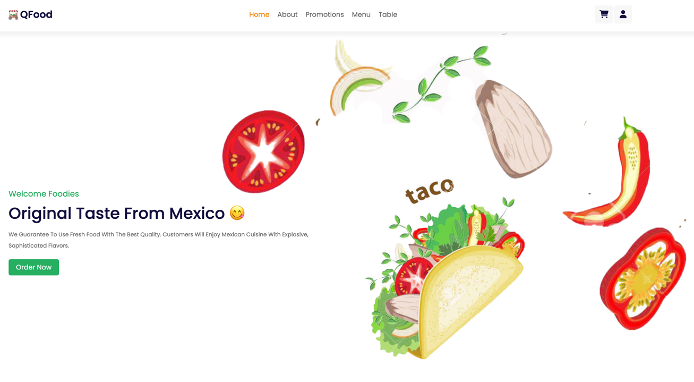
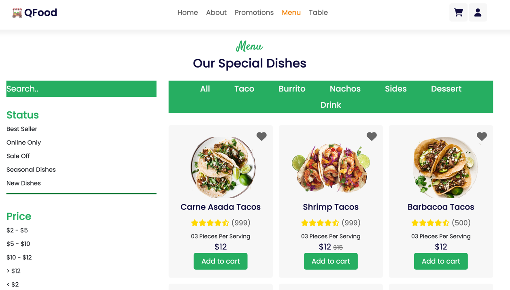

# Restaurant Ordering System 🌮🥗🌯
Welcome to Group 2 Cloud Restaurant Ordering System github repo! We are a large food restaurant company that delivers food to hungry peeps! 

To ensure that our customers don't starve, we need to implement extensive systems' health monitoring to ensure our app is up and running 24/7. 🔪🧑‍🍳 We, the awesome SREs are here to the rescue to ensure that systems and application failures are flagged early and logs are provided for our engineers to troubleshoot. 

So let's get things cooking! 🍳

*PS: this is a fictious project and for educational purposes only. We're not a real company 🥲*

## Technologies Used 
- Deployment: AWS Cloud 
- Monitoring: Grafana
- Logging: Fluentd 

## Architecture Diagram 


# Let's start ordering! 🍽️

This is an application running on Vue with a mySQL database based on this [repo](https://github.com/Quanghihicoder/restaurant-ordering-system).

Landing Page            |  Menu Page
:-------------------------:|:-------------------------:
  |  


## App Deployment

- To set up environmental variables in your local environment, rename `backend/.env.example` to `backend/.env` and 
`frontend/.env.example` to `backend/.env` with updated variables.
- Refer to the `deployment` folder for instructions in deployment in dockers or AWS EKS kubernetes

## Deploying fluentd to enable pod logging 

1. Create a namespace: ```kubectl create ns amazon-cloudwatch```

2. Create fluentd configmap: ```kubectl apply -f ./monitoring-logging/0-configmap.yaml```

3. Apply fluentd monitoring:```kubectl apply -f ./monitoring-logging/1-fluentd-logging.yaml```

4. Check AWS to ensure logs are flowing into cloudwatch.

## Deploying Grafana for AWS Cloudwatch Monitoring

1. Install grafana using helm.
        <details>
        <summary open>
        Code Snippet
        </summary>
        helm upgrade grafana grafana/grafana --namespace monitoring --set service.type=LoadBalancer --set adminPassword='EKS!sAWSome' 


2. Get your Grafana ELB URL using the below command. Update records in Route53 if required.
        <details>
        <summary open>
        Code Snippet
        </summary>

        export ELB=$(kubectl get svc -n monitoring grafana -o jsonpath='{.status.loadBalancer.ingress[0].hostname}')
        echo "http://$ELB"

        


# Challenges 


# Moving Forward 
- Integrating Github actions to build and push images to ECR when building image files


# References
- https://archive.eksworkshop.com/intermediate/240_monitoring/deploy-grafana/
