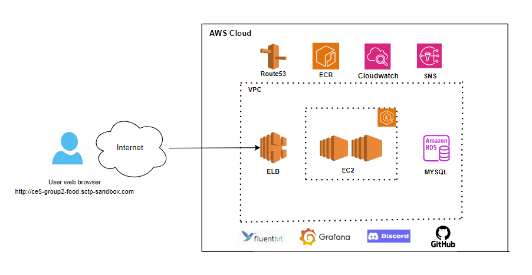

[](https://github.com/StrawberriCake/restaurant-ordering-system/actions/workflows/code_vulnerabilities_scan.yml)
[](https://github.com/StrawberriCake/restaurant-ordering-system/actions/workflows/build_deploy_image.yml)

# SCTP CE Capstone Project - Cohort 5 Group 2
- This repo documents the capstone project as part of a course requirement for the NTU SCTP Cloud Infrastructure Engineering program.
- The repo follows a gitflow branching strategy with main (stores official release history), develop (integrates features), feature and bugfix branches.
- The repo has a `dev` environment for CI/CD testing.
- Team members:   
      1. Jonathan Chin  
      2. Chin Lee Fong  
      3. Koh Siew Lee  
      4. Man Wai Yee  

# Project Overview
## Restaurant Ordering System 🌮🥗🌯
Welcome to Group 2 Cloud Restaurant Ordering System github repo! We are a large food restaurant company that delivers food to hungry peeps! 

To ensure that our customers don't starve, we need to implement extensive systems' health monitoring to ensure our app is up and running 24/7. 🔪🧑‍🍳 We, the awesome SREs are here to the rescue to ensure that systems and application failures are flagged early and logs are provided for our engineers to troubleshoot. 

So let's get things cooking! 🍳

*PS: this is a fictitious project and for educational purposes only. We're not a real company 🥲*

## Objectives
- To monitor a restaurant ordering system application, including the health of the application and the logs generated by the application
- To create alarms to flag any issues with the application
- To automate the infrastructure deployment of the application

## Technologies Used 
- Infrastructure Deployment: Terraform to AWS Cloud 
- AWS services used: EKS, RDS, Cloudwatch, Route53, VPC
- Monitoring: Grafana
- Logging: Fluentd 
- Alerts: Discord
- CI/CD: Github Actions

## Architecture Diagram 


- EKS Cluster: located in a private subnet and is used to deploy the frontend and backend application, TLS certificate manager,
  as well as the fluentd logging agent.
- RDS: located in a private subnet and used to store the application data like user details, menu items and orders.
- Route53: used to route traffic to the EKS cluster.
- Cloudwatch:  used to monitor the EKS cluster and the RDS instance.
- Fluentd: used to collect logs from the EKS cluster and send it to Cloudwatch.
- Grafana: used to visualize the Cloudwatch metrics.
- SNS: used to send alerts to email.


## Website

This is an application running on Vue with a mySQL database and Express.js backend, modified from this [repo](https://github.com/Quanghihicoder/restaurant-ordering-system).

Landing Page            |  Menu Page
:-------------------------:|:-------------------------:
  |  

# Implementation Details

## 1) Provisioning of AWS Infrastructure - Terraform Deployment

- To set up your local environment, copy and rename `secrets.tfvars.example` to `secrets.tfvars` with updated aws secrets.
  `secrets.tfvars` is in `.gitignore` and will not be committed.

- Running terraform
    1. To start terraform

    ```
    terraform init
    ```

    2. To format terraform files

    ```
    terraform fmt -recursive 
    ```

    3. To validate terraform files
    ```
    terraform validate
    ```

    4. To check resources that are going to be created and for any errors

    ```
    terraform plan -var-file="secrets.tfvars"
    ```

    5. To apply the changes

    ```
    terraform apply -var-file="secrets.tfvars"
    ```

    6. To destroy the resources created

    ```
    terraform destroy -var-file="secrets.tfvars"
    ```

    7. If encountering issue deleting resources, list resources and manually remove it in AWS console and run `terraform destroy` again.
       If encounter error when destroying EKS, `Error: Kubernetes cluster unreachable: invalid configuration: no configuration has been provided`, try setting KUBERNETES_MASTER environment variable, run this to resolve it, `export KUBE_CONFIG_PATH=~/.kube/config`
    ```
    terraform state list
    terraform destroy -var-file="secrets.tfvars"
    ```

    8. To access the EKS cluster, change EKS context for `kubectl` to the newly created cluster

    ```
    aws eks --region $(terraform output -raw region) update-kubeconfig --name $(terraform output -raw eks_cluster_name)
    ```

## 2) App Deployment - frontend and backend
- The frontend is a Vue application and the backend is a Express.js application. Both have been dockerized and can be deployed in a kubernetes cluster.
- To set up environmental variables in your local environment, rename `backend/.env.example` to `backend/.env` and 
`frontend/.env.example` to `backend/.env` with updated variables.
- Deployment using docker images to AWS EKS kubernetes
  1. Log in to the cluster

    ```
    aws eks update-kubeconfig --name ce5-group2-eks-cluster --region us-east-1
    ```

  2. Get LB url and update in Route53

    ```
    kubectl get services 
    ```

  4. Switch namespace (note: `restaurant` namespace has already been created in terraform)

    ```
    kubectl config set-context --current --namespace=restaurant
    ```
  
  5. Build frontend and backend container docker images using the environment variables in `.env' file and push to ECR if not using the CICD pipeline. 
     Update the docker image url in the deployment files.
  
    ```
    cd frontend
    docker build --no-cache $(for i in `cat .env`; do out+="--build-arg $i " ; done; echo $out;out="") .
  
    cd backend
    docker build --no-cache -t ce5-group2-backend  $(for i in `cat .env`; do out+="--build-arg $i " ; done; echo $out;out="") .
    ```

  6. Deploy the frontend, backend and ingress

    ```
    cd deployment/kubernetes
    kubectl apply -f backend.yaml --namespace=restaurant
    kubectl apply -f frontend.yaml --namespace=restaurant
    kubectl apply -f ingress.yaml --namespace=restaurant
    ```

  7. To view resources created
    ```
    kubectl get services -n=restaurant 
    kubectl get deployment -n=restaurant 
    kubectl get pods -n=restaurant
    kubectl logs <pod-name> -n=restaurant 
    ```
  8. Add TLS certificate to the EKS cluster
    ```
    helm repo add jetstack https://charts.jetstack.io && helm repo update
    helm install cert-manager jetstack/cert-manager --namespace cert-manager --create-namespace --version v1.10.0 --set installCRDs=true
    kubectl apply -f certificate_issuer.yaml -n=restaurant
    kubectl  describe issuer letsencrypt -n=restaurant
   ```

  9. Access the restaurant order page at https://ce5-group2-food.sctp-sandbox.com/

## 3) Prometheus Monitoring - Deploying Prometheus to monitor EKS cluster
1. create namespace `monitoring`
```
kubectl create namespace monitoring
```

2. helm install prometheus
```
helm repo add prometheus-community https://prometheus-community.github.io/helm-charts
helm repo update
helm install prometheus prometheus-community/kube-prometheus-stack
```

3. port-forward to access Grafana and access it at `http://localhost:3000`
```
kubectl port-forward deployment/prometheus-grafana 3000
user=admin
password=prom-operator
```

4. port-forward to access Prometheus and access it at `http://localhost:9090`
```
kubectl get pod
kubectl port-forward prometheus-prometheus-kube-prometheus-prometheus-0 9090
```


## 5) MySQL - Accessing RDS MySQL Database in private subnet via Bastion Host
- A EC2 bastion host has been created in the public subnet of the VPC with a `.pem` key and security group that allows SSH access from the user's IP.
- To connect to the RDS instance
  1) Add ssh key to ssh client
    ```
    ssh-add ce5-group2-bastion.pem
    ```
  2) SSH to the bastion host
    ```
    ssh -i "ce5-group2-bastion.pem" ec2-user@ec2-52-91-94-235.compute-1.amazonaws.com
    ```

  3) Installation of mysql client on the EC2
    ```
    sudo yum install -y https://dev.mysql.com/get/mysql57-community-release-el7-11.noarch.rpm
    sudo yum install -y mysql-community-client
    # Run the following line if you get a GPG error and then run the previous line again
    sudo rpm --import https://repo.mysql.com/RPM-GPG-KEY-mysql-2022
    ```
  4) To access the database, use the following command
    ```
    mysql -u <username> -p <password> -h ce5-group2-restaurant.chheppac9ozc.us-east-1.rds.amazonaws.com -P 3306
    ```

## 6) CI/CD 
1) Deploying frontend/backend images to ECR and then EKS using Github Actions

      - The `build_deploy_image.yml` pipeline is triggered when a push is made to any branches at the `frontend`/`backend` folder.
      - The pipeline builds the docker image, tags it with the `latest` tag and pushes it to ECR.
      - The pipeline then updates the deployment files with the new image tag and deploys the image to EKS.
        
2) Code Scanning
      - The `code_vulnebilities_scan` is trigger whenever there's any pull request to the `main` and `develop` branch.
      - It scans for vulnerabilities in the frontend and backend code, as well as IAC code.


# Challenges 
1) Complexity of Kubernetes deployment
- Kubernetes itself is a complex container orchestration system and thus has a Steep Learning Curve. 
  Understanding its architecture, components (like pods, services, deployments, namespaces), and operational principles 
  requires a significant amount of study and practice.
2) Productionizing the frontend and backend application
- The frontend and backend application were not production-ready and required additional configuration and setup to be deployed in a kubernetes cluster.
  In addition, the application required additional environment variables to be set up for the application to work correctly.
3) AWS-Specific Implementations
-  EKS integrates with other AWS services like IAM for authentication, ELB for load balancing, and CloudWatch for logging and monitoring.
   Understanding how these services interconnect adds another layer of complexity


# Moving Forward 
1) Adding unit/integration tests for the frontend and backend application as part of the CI/CD pipeline.
2) Implement more stringent security measures like using IAM roles for github actions, grafana dashboard access, and EKS cluster access.
3) Implement robust authentication (e.g., OAuth2, JWT) and authorization (role-based access control) mechanisms for the backend API calls.
4) Store sensitive information (API keys, database credentials) securely using AWS Secrets Manager or AWS Systems Manager Parameter Store.
5) Automate the migrations for MySQL for any schema changes.


# References
- https://archive.eksworkshop.com/intermediate/240_monitoring/deploy-grafana/]()

